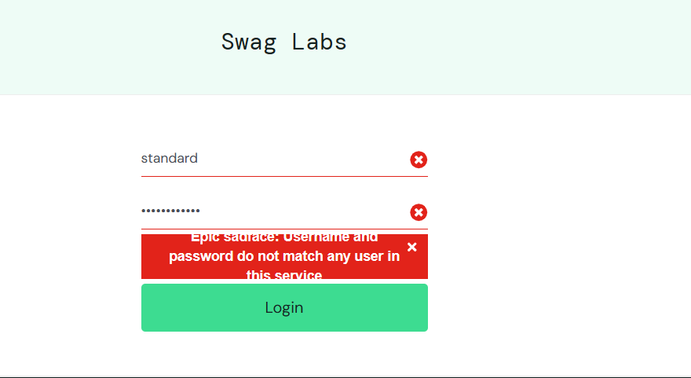
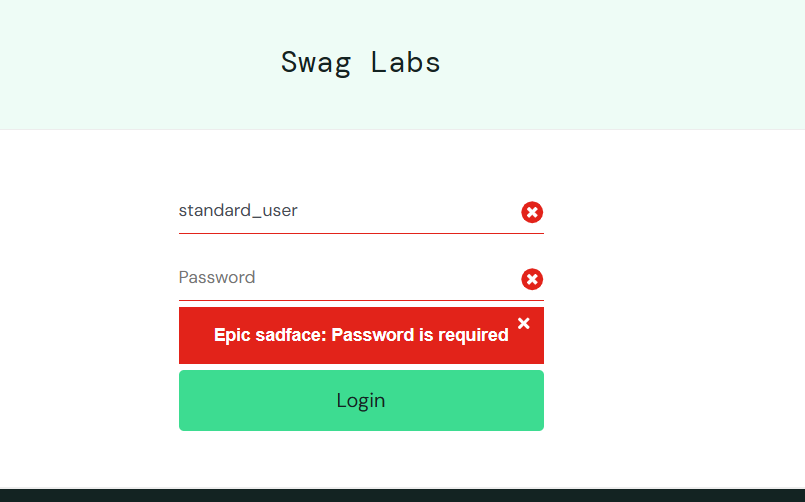
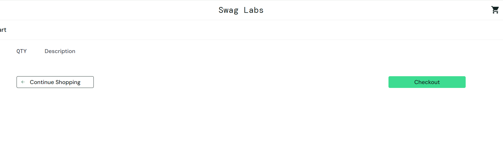
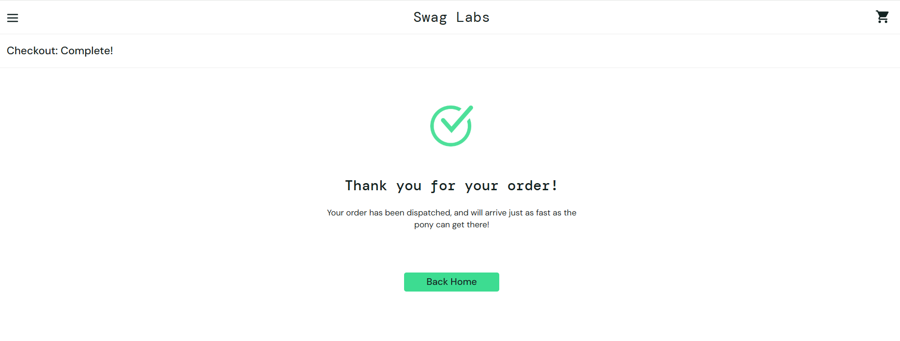

# QA Manual Testing Portfolio

## About This Project

This repository demonstrates my manual software testing skills through a complete testing project performed on the SauceDemo web application.

The project includes test planning, manual test case design, exploratory testing, defect reporting, execution reporting, and supporting documentation created during the testing process.

---

# Project Objectives

* Design and execute manual test cases
* Perform exploratory testing
* Validate application functionality
* Identify and document software defects
* Produce professional QA documentation
* Demonstrate industry-standard software testing practices

---

# Application Under Test

**Application:** SauceDemo

**Testing Types Performed**

* Manual Testing
* Functional Testing
* Exploratory Testing
* Positive Testing
* Negative Testing
* UI Validation

---

# Repository Structure

| File                       | Description                                      |
| -------------------------- | ------------------------------------------------ |
| `test-plan.md`             | Testing strategy, scope, objectives and approach |
| `test-cases.md`            | Manual test cases executed during testing        |
| `observations.md`          | Exploratory testing observations                 |
| `bug-reports.md`           | Confirmed defects identified during testing      |
| `test-execution-report.md` | Test execution summary and results               |
| `screenshots/`             | Supporting screenshots                           |

---

# Modules Tested

* Login
* Products
* Shopping Cart
* Checkout

---

# Skills Demonstrated

* Manual Testing
* Functional Testing
* Exploratory Testing
* Regression Testing
* UI Testing
* Test Planning
* Test Case Design
* Test Scenario Design
* Test Execution
* Test Execution Reporting
* Defect Reporting
* Bug Reproduction
* Root Cause Analysis
* QA Documentation

---

# Test Environment

| Item             | Value         |
| ---------------- | ------------- |
| Browser          | Google Chrome |
| Operating System | Windows 11    |
| Test Application | SauceDemo     |

---

# Project Metrics

| Metric                   |                Value |
| ------------------------ | -------------------: |
| Modules Tested           |                    4 |
| Test Cases Executed      |                   13 |
| Exploratory Observations |                    4 |
| Confirmed Bug Reports    |                    2 |
| Testing Type             | Manual & Exploratory |

---

# Test Summary

* Positive and negative scenarios executed
* Exploratory testing completed
* Multiple test accounts validated
* UI observations documented
* Functional defects reported
* Supporting screenshots collected

---

# Future Improvements

This portfolio will continue to grow with additional manual testing scenarios, API testing, automation testing, database validation and performance testing projects.

---

---

# Screenshots

## Login Validation

Invalid username:

Password required:

---

## Sample Bug Report

**Bug:** Checkout completed successfully with an empty shopping cart.

**Step 1 – Empty shopping cart**

**Step 2 – Order completed successfully**

**Author**

**Radmila Stefanovska**

QA Engineer | Manual Testing | API Testing | Test Automation
